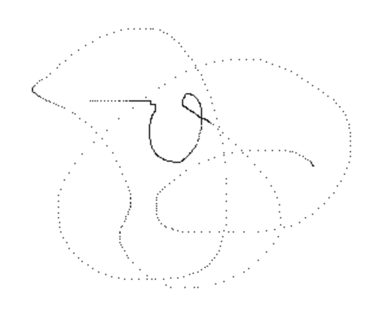
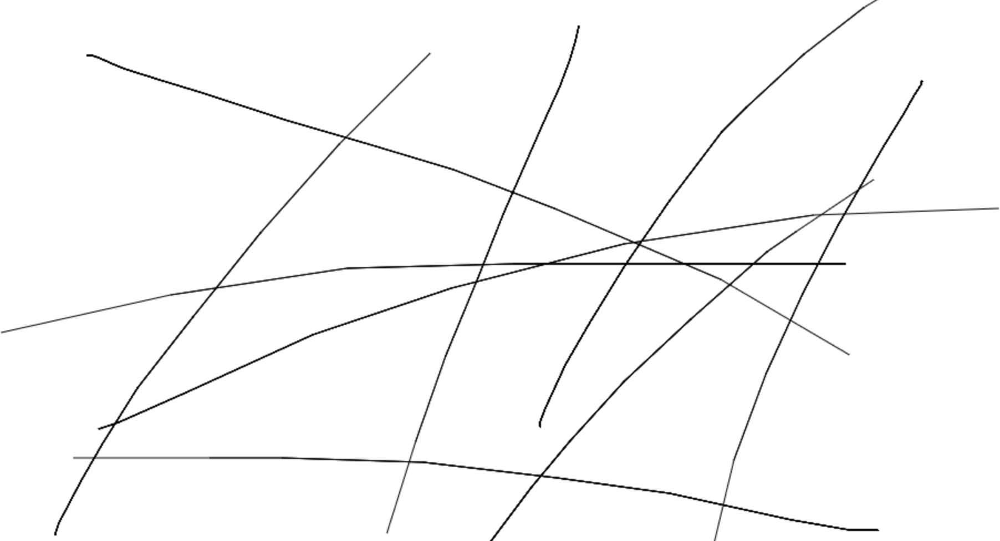

# Painting

## 铅笔绘画

### 基本绘制

首先使用了在鼠标处绘制一个边长为1像素的方块的形式，但是鼠标移动速度稍微比较快，绘制出来的就是非连续的像素块了。

使用 `lineTo()` 的方式明显会更好。

只用 `lineTo()` 会在发生 click（没有 mousemove）的时候无法绘制，于是可以添加一个判断，记录上次坐标，如果两次一样绘制边长为1的方块即可。

mouseleave 的时候也要最后绘制一下，否则会出现画笔移动很快出 canvas，然后边缘部分没画到的情况。

### 每次都 beginPath()？

有一个需要注意的地方是每次绘制（`mousedown` -> `mousemove` -> `mouseup`）都 `beginPath()` 一下比较好。要不然每次都会把之前的 path 再 stroke 一遍，会让颜色变深一些（线更粗一些）。

重新 stroke 为什么颜色会变深？之前学习 canvas 绘制的时候我们知道，当 lineWidth 是奇数时，绘制一条竖直或水平方向的线，看起来都是模糊的，因为画笔的轨迹没有办法只占整数轴两边坐标各一半，只能对整个像素做模糊处理。重复描绘这些模糊的地方会让颜色变深。

画斜线的时候这种现象会更明显一些。

### 绘制斜线的问题

移动很慢的时候宽度会超大。即使 lineCap 是 round，draw过程还是会有方块出现。

## canvas 大小自适应

监听 resize 达到 canvas 大小自适应的效果，难处在 canvas 在 resize 之后高度大小不好确定。

目前的问题是，缩小视口尺寸 canvas 无法很好地自适应。没有好想法，感觉很麻烦，先搁置。

resize 之后不让原本的图像消失很重要，想法是用一个双端队列记录下每个 path，然后重新绘制一遍。这个队列也可以用来做撤销操作。

`Path2D` 对象似乎很符合上述功能。使用一个 Path2D 数组记录每次的 path 和类型（fill | stroke），可以做 restore，而且也可以做到撤销操作。

## 全局配置

一个全局的 config 对象，更新可以被所有引用项感知。

**想法 1：** 写个观察者模式，但是发现 config 变化似乎并不需要什么回调，放弃。
**想法 2：** 单例 config 对象，单后发现由于 es6 module 使用的是只读**引用**的方式，所以压根不需要自己实现一个单例对象，直接 `export default config` 完事。

于是折腾了挺久发现完全可以很简单地写出来。基础不牢，胡思乱想。
